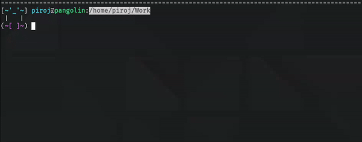
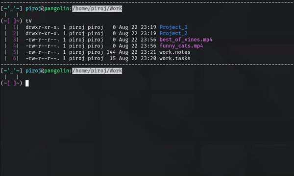
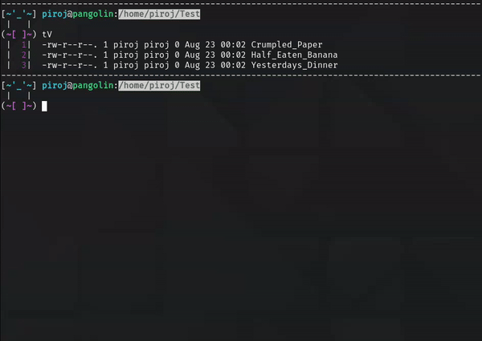
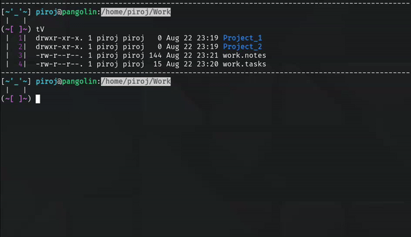
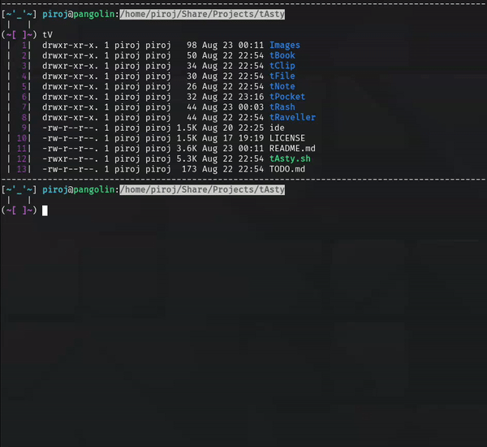
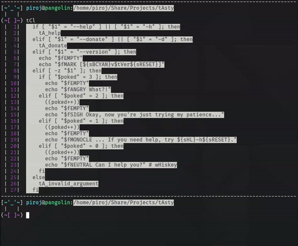

# tAsty

*The Alias Supplement ThingY*

**tAsty** is an extension for your ~/.bashrc file aimed at simplifying commonly performed tasks within the **bash** shell. With a focus on productivity and file management, some of **tAsty**'s key features include:

### tBook

A place to store custom **bash** aliases. Simply run the command `tBo` to view all your current aliases. **tBook** consists of three distinct components:

*   ***tIcket***. Used to add, view, and remove **cd** aliases. Useful for bookmarking frequented directories.

*   ***tLink***. Used to add, view, and remove **unison** aliases. Useful for synching local and remote directories.

*   ***tCraft***. Used to add, view, and remove custom **bash** aliases. Useful for simplifying any task in **bash** not covered by **tAsty**'s other components.

### tRaveller

A collection of shell navigation tools. **tRaveller** includes tools such as **tView** for intelligently viewing the contents of files and directories, **tSearch** for searching your current working directory for files containing a specified string, **tFilter** for filtering the output of any **bash** command by keyword or line number, and more.

### tFile

A collection of command line file management tools. For example, **tSelect** allows management of multiple files/directories simultaneously. Similarly, **tRename** is a bulk rename tool. **tFile** also includes productivity essentials such as **tWrite**, **tLock**, **tSave**, and much more.

### tRash

Bring trash can functionality to your **bash** shell. **tRash** works just like your desktop's trash can, with the ability to shred or restore its contents with a single command.

### tPocket

**tPocket** is a convenient place to store commonly used files/directories. You can copy targets into your **tPocket** for later use, and then paste its contents into a target destination. **tPocket** can also be saved, loaded, or its contents shredded with a single command.

### tClip

**tAsty** also includes its own clipboard. Use **tClip** to quickly copy and append the contents of files viewed with **tView** (see ***tRaveller*** above). Additionally, clear the contents, paste to **tNote** (see ***tNote*** next), or open up your **tClip** for editing with a single command.

### tNote

Convenient note-taking in **bash**. Opens for editing in your preferred command line text editor (`EDITOR=[name]` where *name* is the name of your favorite editor, often found in your `~/.bashrc` file). A single command to view and manage all your notes, all in one place.

## Installation

1.  In your **bash** shell, navigate to the directory you'd like to store **tAsty** in.

    *   Be sure to choose a *permanent* location, as moving the following download after installation will break **tAsty**.

1.  `git clone https://github.com/p1r0j/tAsty.git`

2.  `cd tAsty`

3.  `./tAsty.sh --setup`

4.  Follow the instructions printed to your terminal. From here, you will simply copy/paste the line that **tAsty setup** provided (i.e. `source /home/tastyUser/Git/tAsty/tAsty.sh`) to the bottom (or some other empty area) of your `~/.bashrc` file.

5.  Finally, run the command `source ~/.bashrc`. Your command prompt should change, signifying a successful installation.

