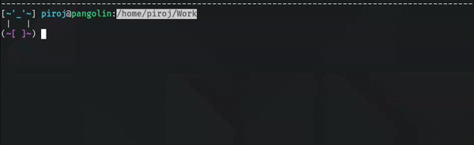

# tAsty

*The Alias Supplement ThingY*

**tAsty** is an extension for your ~/.bashrc file aimed at simplifying commonly performed tasks within the **Bash** shell. With a focus on productivity and file management, **tAsty** aims to fully replace the need for a stand-alone file manager (see **tSelect** in the ***tRaveller*** section below for what is likely the clearest example of this notion), while giving advanced users the power to extend its functionality even further (see **tCraft** below).

For more information on each of **tAsty**'s modules, see their respective sections just below. For installation help, skip to the bottom to find the ***Installation*** section. If you find this project useful or simply wish to support its author, you can donate [here](https://buymeacoffee.com/piroj).

### tPrompt

Make **Bash** easier to look at. Includes a divider between each command, as well as a playful face which can be adjusted to match your current mood.

`tA --neutral` (change to neutral face)
`tA --happy` (change to happy face)
`tA --sad` (change to sad face)
`tA --inquisitive` (change to inquisitive face)
`tA --angry` (change to angry face)

### tBook

View, edit, and delete custom aliases using **tIcket**, **tLink**, and **tCraft**.

`tBo` (view all aliases)

`tBo -v [target]` (view contents of target alias)

`tBo -e [target]` (open target alias for editing)

`tBo -d [target]` (delete target alias)

`tBo --shred` (delete all aliases)

#### tIcket

Add, view, and delete **cd** aliases. These can be used like bookmarks to quickly travel to frequented locations within your file system.

`tI` (view all aliases)

`tI -a "[target]"` (add new alias)

`tI -v [target]` (view contents of target alias)

`tI -e [target]` (open target alias for editing)

`tI -d [target]` (delete target alias)

`tI --shred` (delete all aliases)

#### tLink

Add, view, edit, and delete **unison** aliases. **Unison** syncs two targets bidirectionally, making it especially useful for linking a remote directory with a local one.

`tLi` (view all aliases)

`tLi -a "[target1]" "[target2]"` (add new alias)

`tLi -v [target]` (view contents of target alias)

`tLi -e [target]` (open target alias for editing)

`tLi -d [target]` (delete target alias)

`tLi --shred` (delete all aliases)

#### tCraft

Add, view, edit, and delete custom aliases. **tCraft** allows you to create an alias from any command, extending **tAsty**'s functionality in whatever way you see fit.

`tCr` (view all aliases)

`tCr -a "[command]"` (add new alias)

`tCr -v [target]` (view contents of target alias)

`tCr -e [target]` (open target alias for editing)

`tCr -d [target]` (delete target alias)

`tCr --shred` (delete all aliases)

### tRaveller

A collection of shell navigation tools. **tRaveller** includes tools such as **tView** for intelligently viewing the contents of files and directories, **tSearch** for searching your current working directory for files containing a specified string, **tFilter** for filtering the output of any **Bash** command by keyword or line number, and more.

### tFile

A collection of command line file management tools. For example, **tSelect** allows management of multiple files/directories simultaneously. **tFile** also includes productivity essentials such as **tWrite**, **tLock**, **tSave**, and much more.

### tRash

Bring trash can functionality to your **Bash** shell. **tRash** works just like your desktop's trash can, with the ability to shred or restore its contents with a single command.

### tPocket

**tPocket** is a convenient place to store commonly used files/directories. You can copy targets into your **tPocket** for later use, and then paste its contents into a target destination.

### tClip

**tAsty** also includes its own clipboard. Use **tClip** to quickly copy and append the contents of files viewed with **tView** (see ***tRaveller*** above). Additionally, clear the contents, paste to **tNote** (see ***tNote*** next), or open up your **tClip** for editing with a single command.

### tNote

Convenient note-taking in **Bash**. Opens for editing in your preferred command line text editor (`EDITOR=[name]` where *name* is the name of your favorite editor, often found in your ~/.bashrc file). A single command to view and manage all your notes, all in one place.

## Installation

1.  In your **Bash** shell, navigate to the directory you'd like to store **tAsty** in.

    *   Be sure to choose a *permanent* location, as moving the following download after installation will break **tAsty**.

1.  `git clone https://github.com/p1r0j/tAsty.git`

2.  `cd tAsty`

3.  `./tAsty.sh --setup`

4.  Follow the instructions printed to your terminal. From here, you will simply copy/paste the line that **tAsty setup** provided (e.g. `source /home/tastyUser/Git/tAsty/tAsty.sh`) to the bottom (or some other empty area) of your ~/.bashrc file.

5.  Finally, run the command `source ~/.bashrc`. Your command prompt should change, signifying a successful installation.

